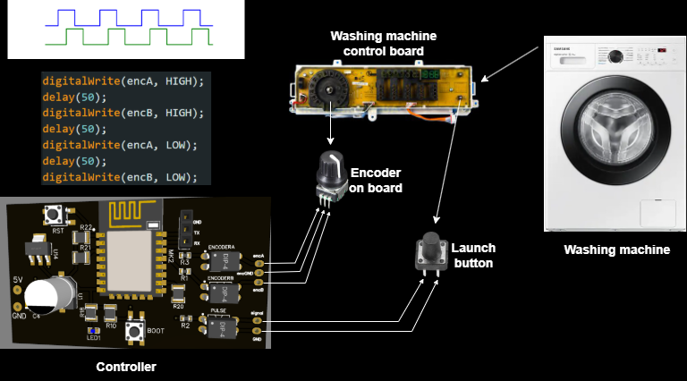

# Smart Laundry Payment Module (ESP8266)

> **Commercial project – deployed across multiple laundromats in Kazakhstan**

---

## 📋 Project overview

A custom ESP8266‑based control board that starts a washing machine **only after the customer has paid via a Kazakhstani bank’s mobile app**.  The module mimics the machine’s rotary‑encoder signals through optocouplers, so the washer “thinks” a user turned the knob locally.  All payment logic lives on a remote server; the board polls that server over HTTP and triggers the wash cycle once payment is confirmed.

| Role                                         | Team size   |
| -------------------------------------------- | ----------- |
| **Hardware / firmware design & integration** | 1 (me)      |
| Server / payment backend                     | 1 colleague |

---

## ✨ Key features

* **Contact‑less payment** – customers pay inside their regular banking app, no extra app required.
* **Safe appliance control** – three optocouplers isolate low‑voltage logic from the washer’s 230 V electronics.
* **Minimal UI** – BOOT & RST tactile buttons and a UART header for debugging.
* **OTA‑ready** – firmware organised for future over‑the‑air updates.
* **CNC‑milled PCB** – single‑sided FR‑4 milled on a desktop CNC.

---

## 🛠️ Hardware

| Item              | Part No. / details                                 |
| ----------------- | -------------------------------------------------- |
| MCU               | ESP-12F (ESP8266)                                  |
| Voltage regulator | AMS1117-3.3 V                                      |
| Optocouplers      | 3 × PC817 (or equivalent)                          |
| Misc              | 10 µF + 560 uF, resistors, pin‑headers, tactile switches |

*Schematics & PCB files live in* [`hardware/`](hardware/).

---

## 📊 System block diagram



*PNG file is stored in `media/photos/block-diagram.png`. Replace the image if you redraw the scheme.*

---

## 🔌 Wiring

1. Identify A/B signals of the washer’s rotary encoder.
2. Solder the optocoupler outputs in parallel to these lines.
3. Feed 5 V – 12 V into the board’s VIN; AMS1117 down‑regulates to 3.3 V.

> ⚠️ **230 V hazard** – installation must be performed by qualified personnel.

---

## 💻 Firmware

Project uses **PlatformIO + Arduino core for ESP8266**.

```
firmware/
├── platformio.ini          # build settings
└── src/
    ├── main.cpp            # state machine, HTTP polling
    ├── config_example.h    # template for secrets (copy → config.h)
    └── ...
```

### 1 · Configure secrets

Copy `config_example.h` → `config.h` and fill in **your** Wi‑Fi SSID, password, server host and API path. The real `config.h` is ignored by Git via `.gitignore`.

```cpp
#pragma once
const char* ssid     = "YOUR_WIFI_SSID";
const char* password = "YOUR_WIFI_PASSWORD";
const char* host     = "example.com";          // e.g. nbh-soft.kz
const char* apiPath  = "/api/v1/payments/";    // MUST end with slash
```

### 2 · Build & flash

```bash
$ cd firmware
# compile & upload over USB‑TTL
$ platformio run -t upload -p /dev/ttyUSB0
```

---

## 🌐 Server API (HTTP)

> **Note:** The endpoint below is **masked** for public release. The firmware actually hits:
>
> ```text
> /qring.php?command=state&id=...
> ```
>
> The example path makes the documentation cleaner without exposing production internals.

| Endpoint                               | Method | Payload | Description                        |
| -------------------------------------- | ------ | ------- | ---------------------------------- |
| `/api/v1/payments/{machine_id}/status` | GET    | –       | returns `{ "paid": <sum in KZT> }` |

Detailed request/response examples live in [`docs/api.md`](docs/api.md).

---

## 🚀 Deployment flow

1. Install hardware inside washer and power up.
2. Connect ESP8266 to laundromat Wi‑Fi / 4G router.
3. Customer scans QR‑code → pays in banking app.
4. Server marks payment **paid**.
5. Module sends encoder pulses according to the paid amount → wash starts.

---

## 📸 Media

High‑res photos and demo videos live in:

```
media/photos/
media/videos/
```

---

## 📝 License

No open‑source license applied yet – repository shared for portfolio purposes.

---

## 🙋‍♂️ Author

**Your Name** – electronics design, PCB layout, firmware, integration.

Feel free to reach out: [your.email@example.com](mailto:your.email@example.com)

---

## 🗂️ Repository structure

```
laundry-payment-module/
├── hardware/           # EasyEDA schematic & PCB
├── firmware/           # ESP8266 source (PlatformIO)
├── media/
│   ├── photos/         # images
│   └── videos/         # demos
├── .gitignore          # excludes config.h and build artifacts
└── README.md           # → you are here
```

